## 会员体系

**<h4 id="1"> 
 会员体系 
</h4>**

**会员等级**

打开梦数互动大屏首页，切换至“定价”页面，向下滑动页面，既可看到会员相关信息：
**普通会员:** 注册成功即成为普通会员，享受现场参会最高人数 100 人、活动发布次数 10 次、功能同时使用数量 3 个、存储空间 1G、活动持续时间 24h；
**白银会员:** 升级为白银会员，享受现场最高参会人数 300 人、功能同时使用数量 5 个、存储空间 20G、开通期限 360 天；
**黄金会员:** 升级为黄金会员，享受现场最高参会人数 1000 人、功能同时使用数量 7 个、存储空间 50G、开通期限 360 天；
**铂金会员:** 升级为铂金会员，享受现场最高参会人数 2000 人、功能同时使用数量 10 个、存储空间 100G、开通期限 360 天；
**钻石会员:** 升级为钻石会员，现场最高参会人数无限制、功能同时使用数量无限制、存储空间 500G、开通期限 360 天；

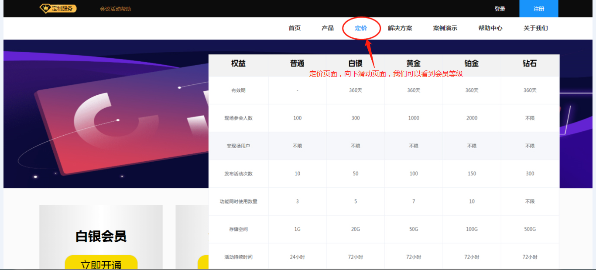

**1、会员开通、会员升级及会员续费**
普通会员可以开通会员，已经是会员的用户（非钻石会员）可以进行会员升级及续费；
**（1）开通会员**
普通用户点击右上角用户昵称，选择下拉框中的“开通会员”，选择所要开通的会员类型，点击【立即开通】，即可开通成功；

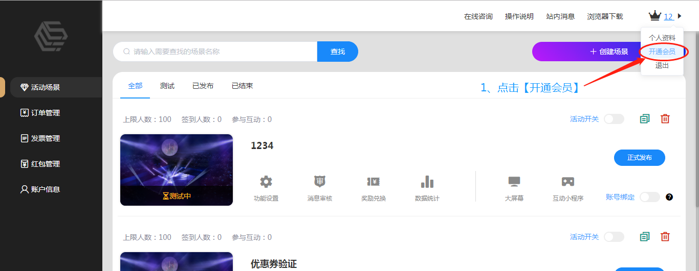

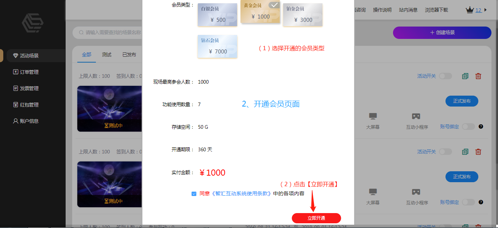

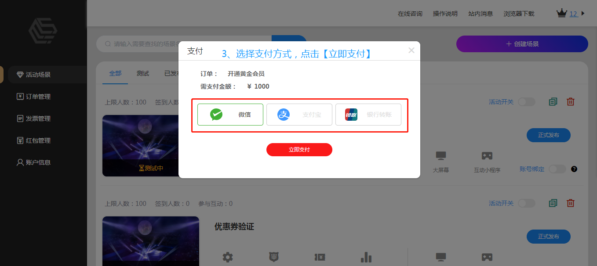

**（2）会员升级**

已经是白银会员、黄金会员、铂金会员的用户，可以进行会员升级；
白银会员可以升级为黄金会员、珀金会员、钻石会员；
黄金会员可以升级为珀金会员、钻石会员；
珀金会员可以升级为钻石会员；
钻石会员已经是最高级别的会员，不能进行升级了；

① 点击页面右上角用户昵称处，点击【会员升级】

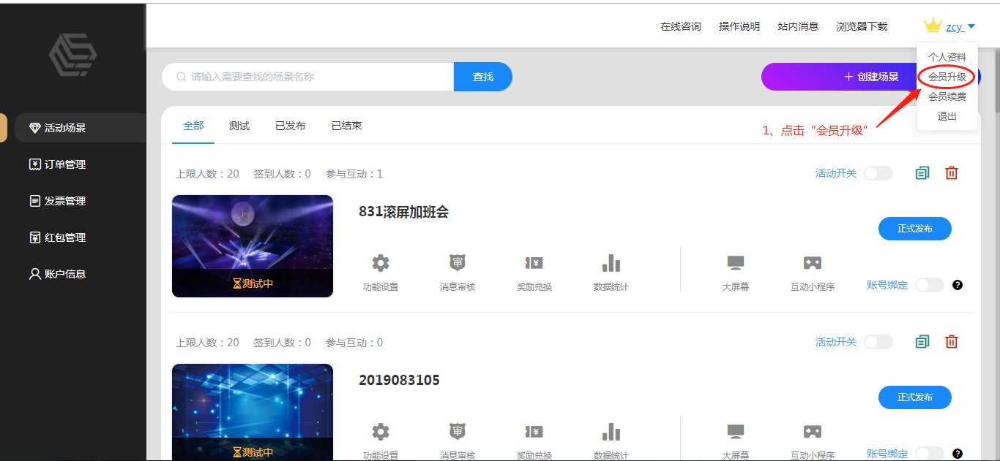

② 选择会员类型

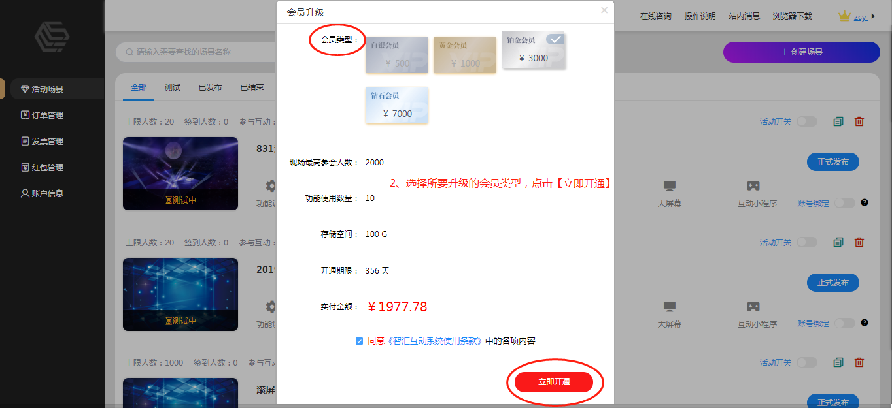

③ 支付费用后即可升级成功

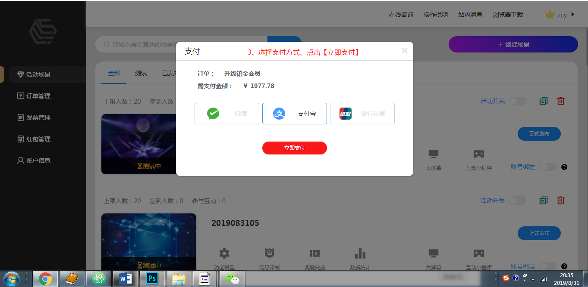

**会员升级天数及金额计算方式：**
① 会员开通：
普通会员开通成为白银会员，开通期限为 360 天、实付金额为：500 元；
普通会员开通成为其他会员类似；

② 会员升级
假如当前用户已开通白银会员 5 天，要升级为黄金会员，则计算方式如下：
● 开通期限 = 360 天-5 天 = 355 天
● 实付金额 = （1000-500）/360\*(360-5) =493.06 元
其他会员升级类似

**（3）会员续费**
白银会员、黄金会员、铂金会员、钻石会员可以进行续费，续费后，发布次数和会员期限会相应增加；
① 点击页面右上角用户昵称处，点击【会员续费】

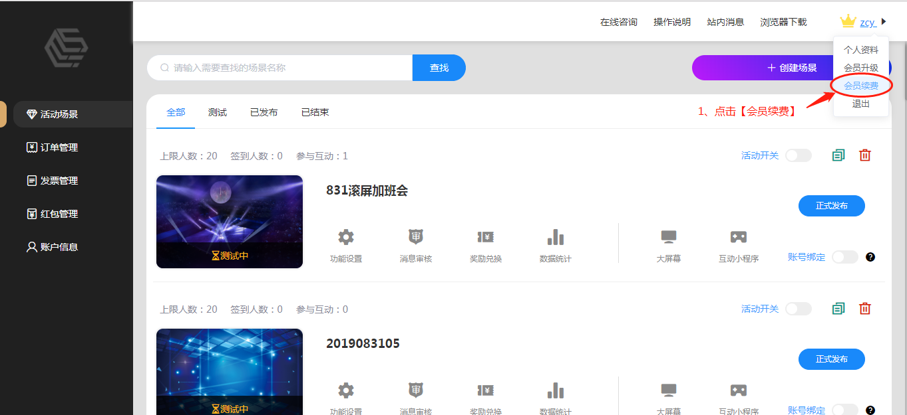

② 续费页面，会员类型为用户所属会员等级，点击【立即开通】

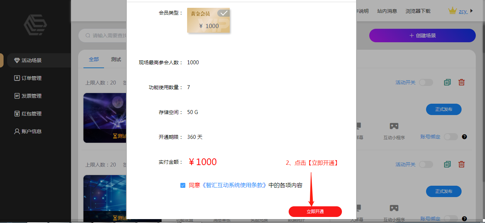

③ 选择支付方式，支付费用后即可续费成功

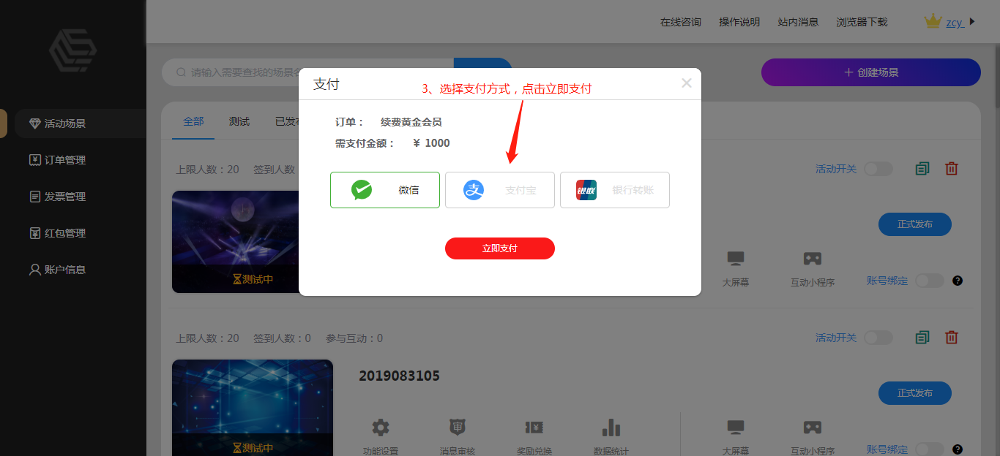

**2、优惠券码**
我们会有优惠券码，场景在正式发布页面，优惠码输入框内输入优惠码，点击【查找】，就会出现优惠金额，抵扣相应的活动场景费用。

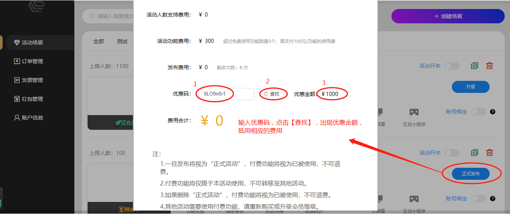

## 如何支持 100 人以上的会议？

**<h3 id="1"> 
 如何支持 100 人以上的会议？ 
</h3>**
注：以下以“普通用户”为例

场景在创建成功后，状态为“测试中”，享受现场参会最高人数 20 人，“测试中”状态的场景最高参会人数与会员等级无关。

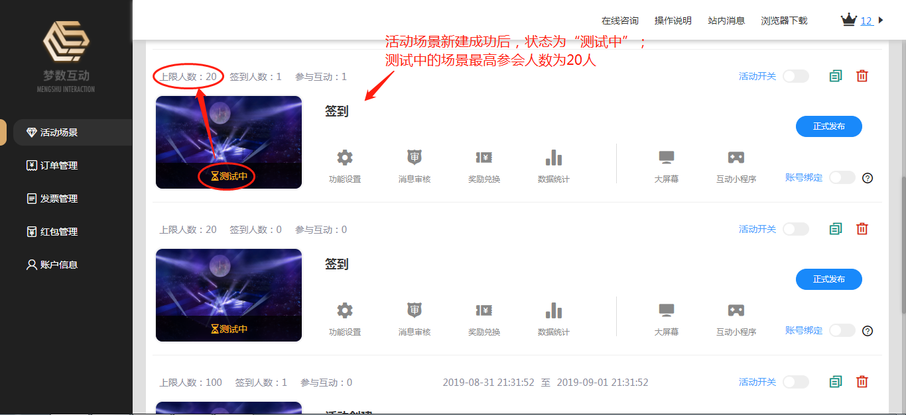

2、当我们的场景【正式发布】后，场景至少支持参会人数 100 人，不同的会员等级支持的参会人数不一样，具体如下：
普通会员享受现场最高参会人数 100 人；
白银会员享受现场最高参会人数 300 人；
黄金会员享受现场最高参会人数 1000 人；
铂金会员享受现场最高参会人数 2000 人；
钻石会员享受现场最高参会人数无限制；

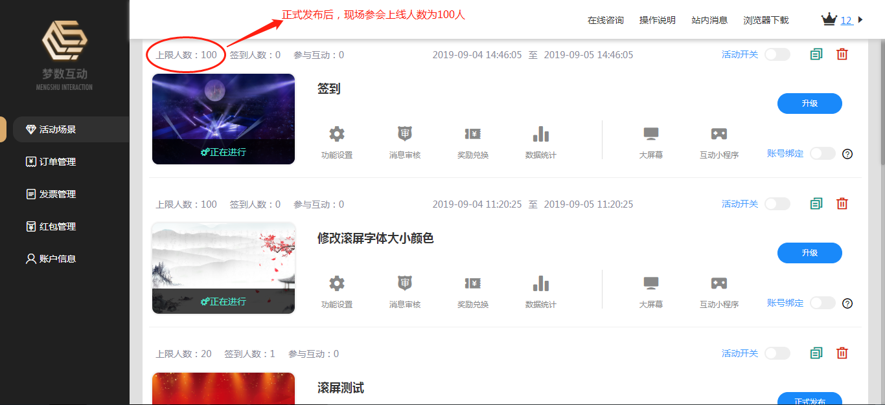

3、如果是普通会员，不想进行会员升级，但是参会人户多怎么办？？

（1）场景【正式发布】时，可以新增参会人数；
在 【正式发布】时，收费人数处可以输入所需新增人数（活动支持人数处）；
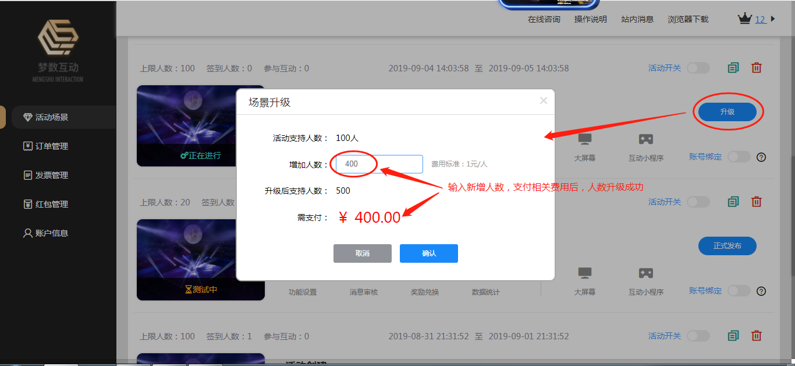

（2）通过场景【升级】，可以新增参会人数；
我们可以对已经发布的场景，点击【升级】，输入所需增加的人数，付款成功即可；

升级后，场景上限人数显示为已经升级后的人数，升级之后的场景还可以进行“升级”；

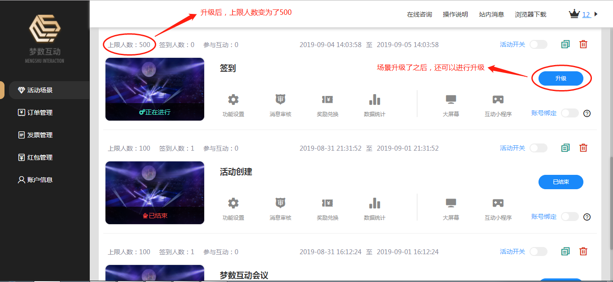

## 定制服务

**<h3 id="1"> 
 定制服务 
</h3>**
**1、如何定制功能：**

为满足您的个性化需求，我们可为您提供专属定制服务（详情可进入官网咨询客服 QQ）。该定制包括不限于大屏幕风格定制、LOGO 墙定制、互动效果定制、特殊功能定制、特殊分辨率定制等。

<!--客户需求确认--计数评估--方案规划--计数沟通--确认方案--定制实施--客户验收-->

**2、定制流程：**

客户与销售沟通详细需求 → 技术确认需求能否实现 → 能实现 → 销售向客户确认定制时间并报价 → 客户接受定制报价 → 技术开始设计。

**3、定制时间：**

个性化定制服务所需时间长短不一，我们将根据您的定制需求第一时间向您确认定制时间，并尽快完成定制服务。

**4、定制提示：**

若定制需求不能实现，请您重新提交定制需求或放弃定制。

## 会议活动帮助

会议活动

## 复制、删除活动场景

**<h3 id="1"> 
 复制、删除活动场景 
</h3>**
**1、复制场景**
假如我们想创建一个类似的场景，但是又不想重复设置配置信息，那么我们可以通过复制活动场景来创建一个新的类似的场景。
复制的场景会保存原场景的设置信息，清除原场景活动签到人员信息及互动结果数据；

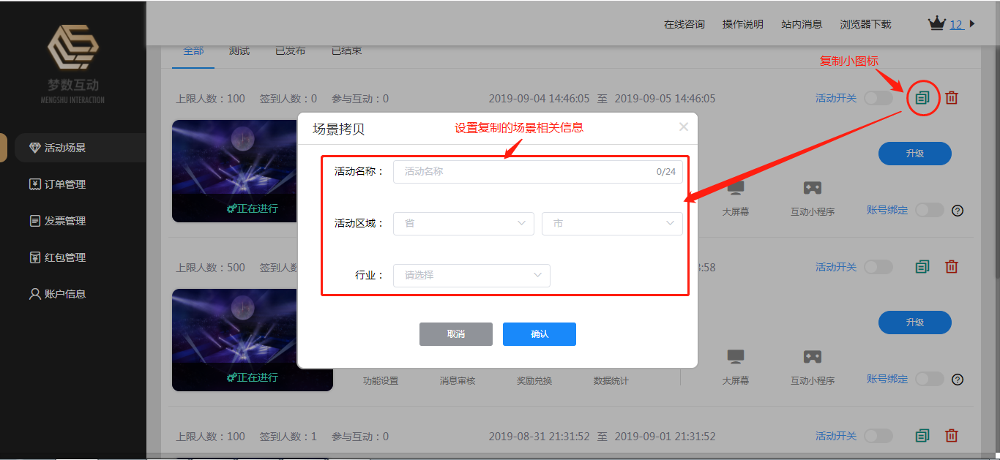

**2、删除场景**
对于任何状态下的场景，点击【删除】小图标，场景都可以删除成功，删除成功后，该活动场景会从活动场景列表中消失；

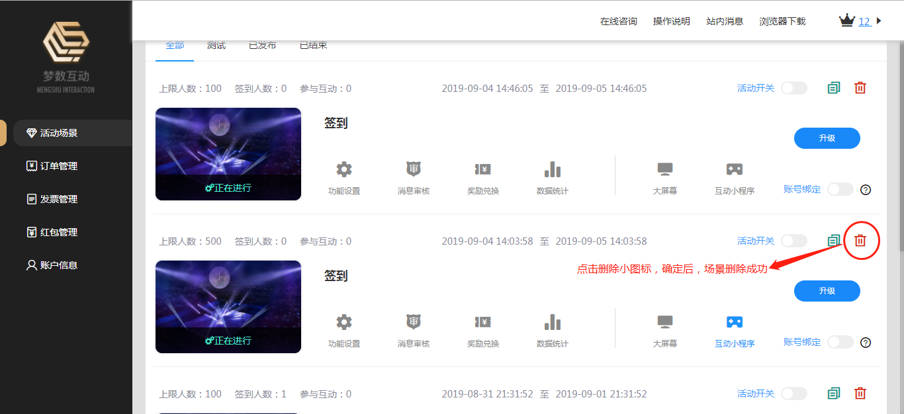

## 场景状态

**<h3 id="1"> 
 场景状态 
</h3>**

**1、“测试中”状态**

新建场景成功后，场景的状态为“测试中”

**2、“正在进行”状态**

场景【正式发布】后，状态变为“正在进行”，活动场景开始时间为场景正式发布时的时间，活动场景的有效期为 24 小时

**3、“已结束”状态**

对于已经正式发布后的活动场景，超过活动持续时间后，场景状态会变成“已结束”

## 注册与登陆

**<h3 id="1"> 
 注册与登录 
</h3>**
**1、如何注册**
（1）打开浏览器，进入梦数互动会议官网，在右上角处点击“注册”

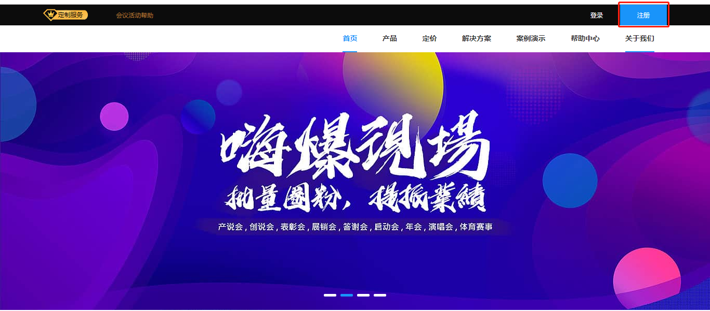

（2）填写相关“注册”内容，即可注册成功
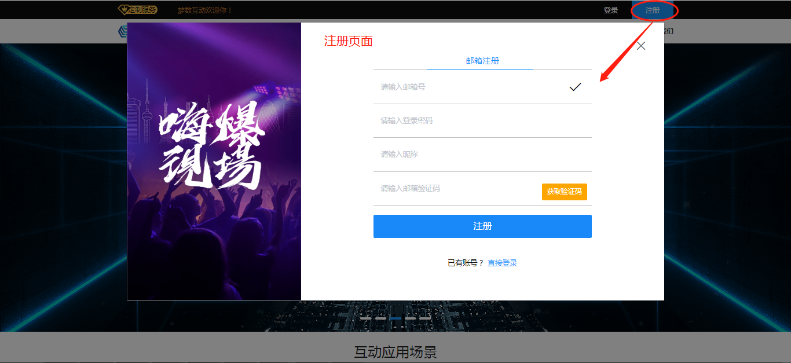

**2、如何登陆**
同注册一样，打开浏览器，进入梦数互动官网，点击右上角的“登陆”字样，填写登录信息，即可完成登录

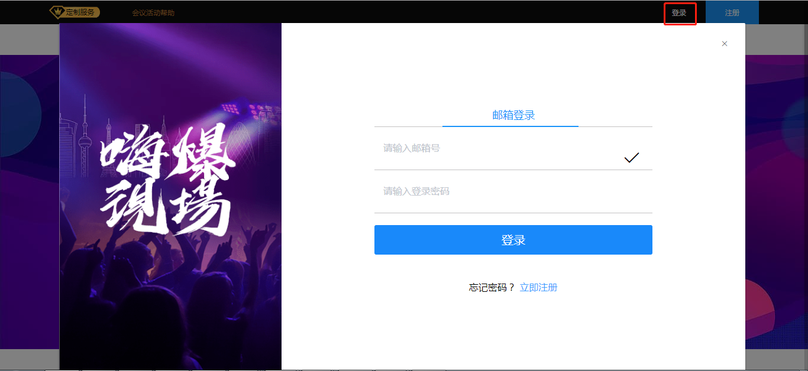

**3、进入管理端**
用户登陆成功后，进入到管理设置页面，用户可以创建活动场景、管理活动、活动功能页设置、活动预览等详细的操作

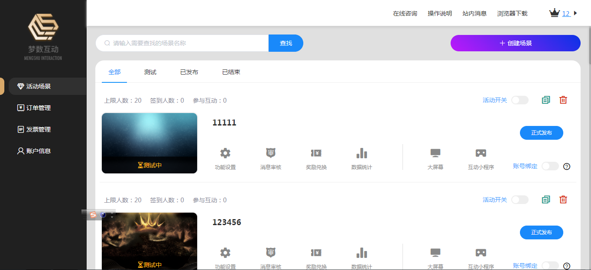

## 新建活动

**<h3 id="1"> 
 新建活动 
</h3>**
1、登陆梦数互动大屏后，点击活动场景页右上角的【创建场景】按钮

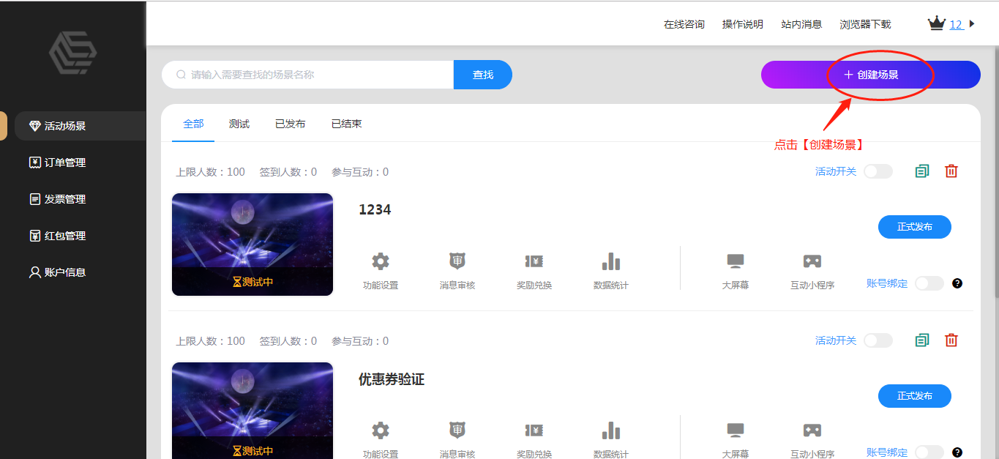

2、填写活动场景信息、选择功能模块，设置活动背景及相关 logo，点击【创建】，活动创建成功

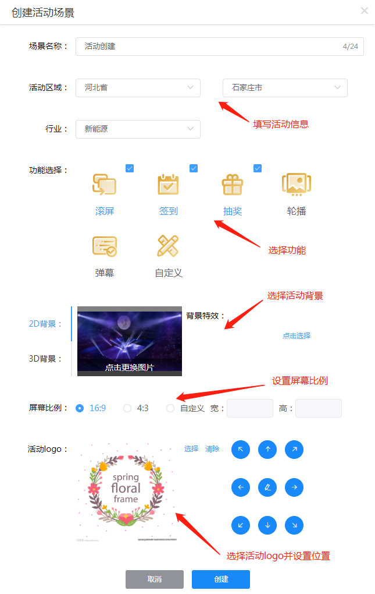

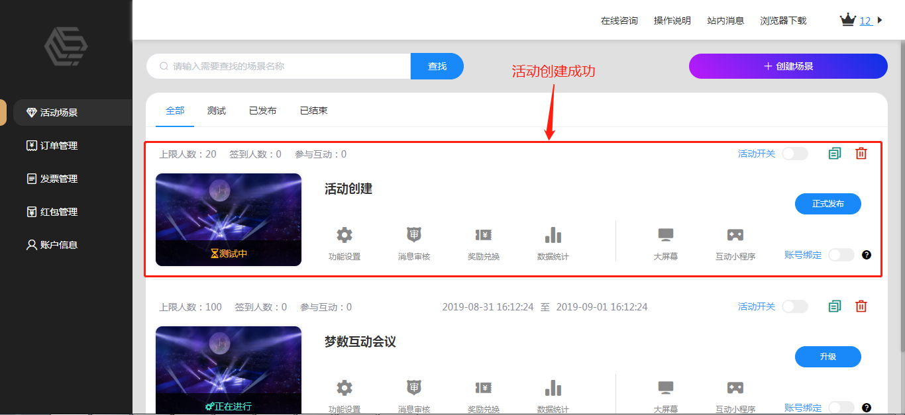

## 发布活动

**<h3 id="1"> 
发布活动 
</h3>**
1、点击活动场景的【正式发布】按钮

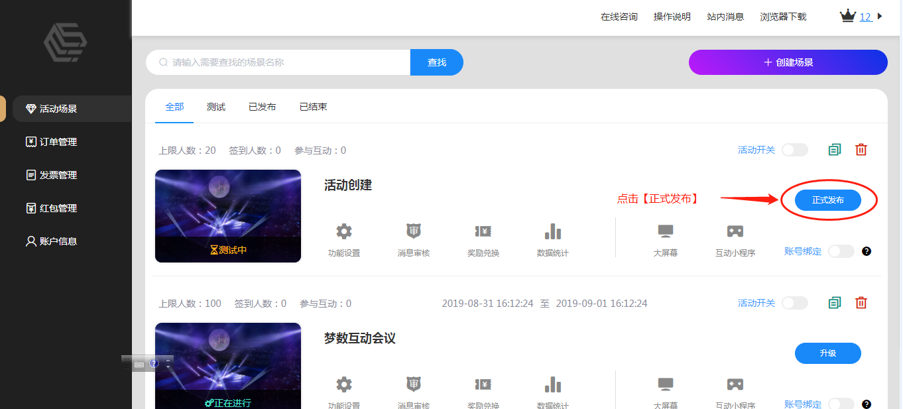

2、填写所需参会人数、优惠码，点击【支付并发布】，选择支付并类型，支付成功后，场景发布成功；

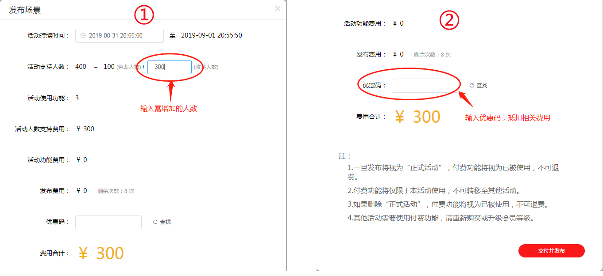

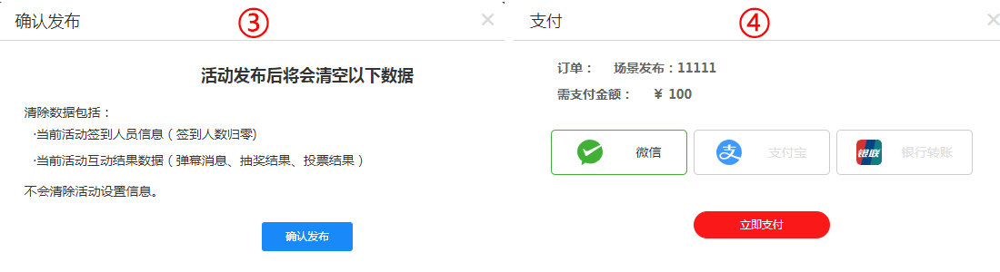

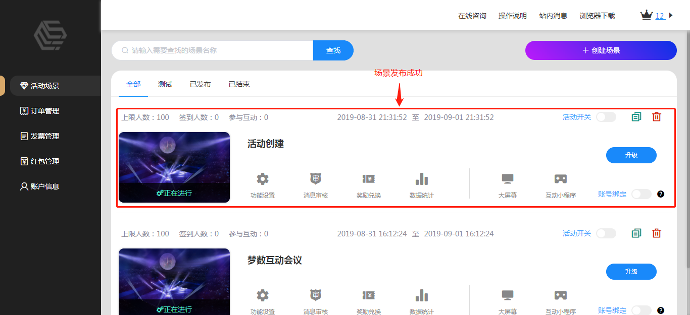
**<h3 id="1"> 
观众参与 
</h3>**
用户通过场景生成的二维码，分享给用户，微信扫描二维码，进入小程序，签到后既可参与现场互动；

1、活动场景二维码生成

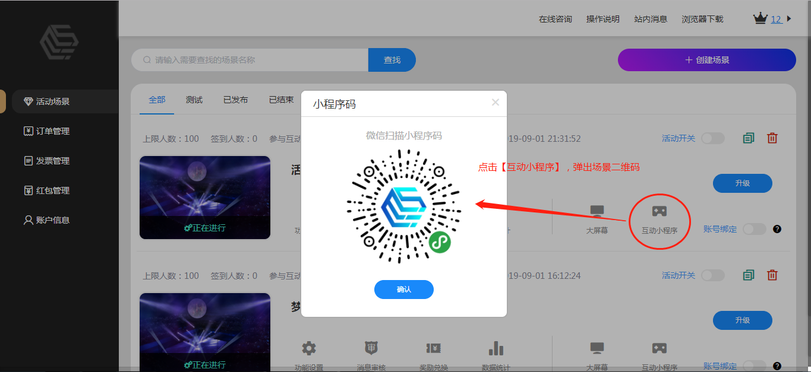

2、用户扫描二维码进入小程序，进行活动签到

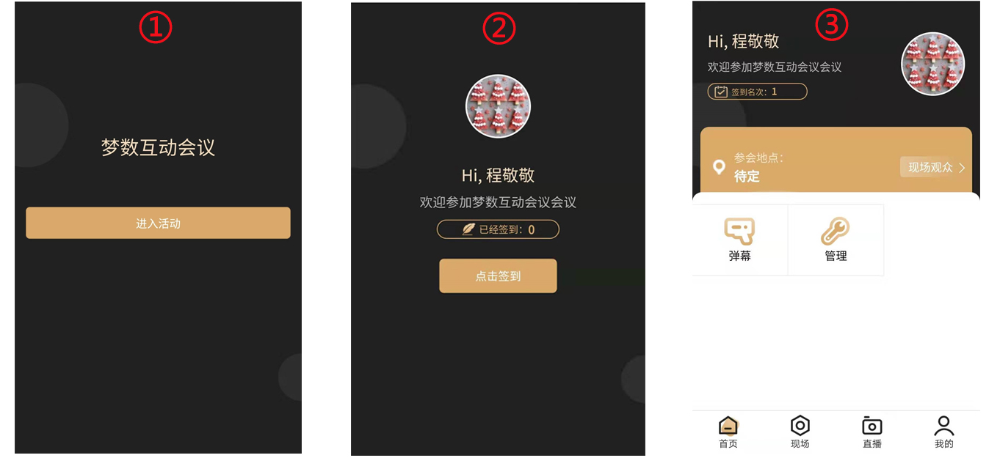

## 现场互动

**<h3 id="1"> 
 现场互动
</h3>**
1、用户扫描场景二维码，进入互动小程序，签到成功后，进入互动页面

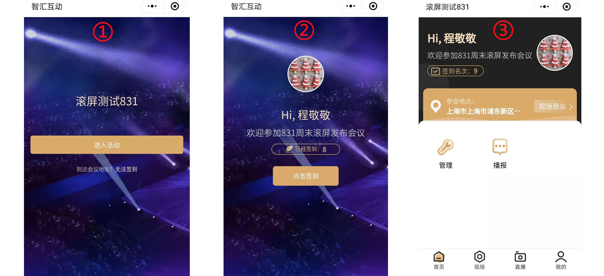

2、小程序中的现场模块下，我们可以通过快捷语、语音识别、手动输入内容发送弹幕，还可以设置弹幕样式

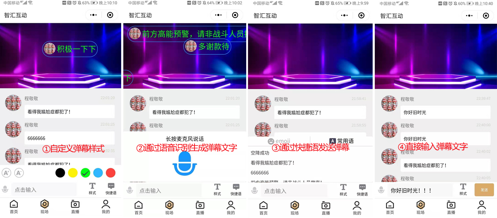

3、通过【播报】模块可录入滚屏相关数据，参与现场大屏互动

管理端可添加互动管理员，控制参会观众是否可以录入数据

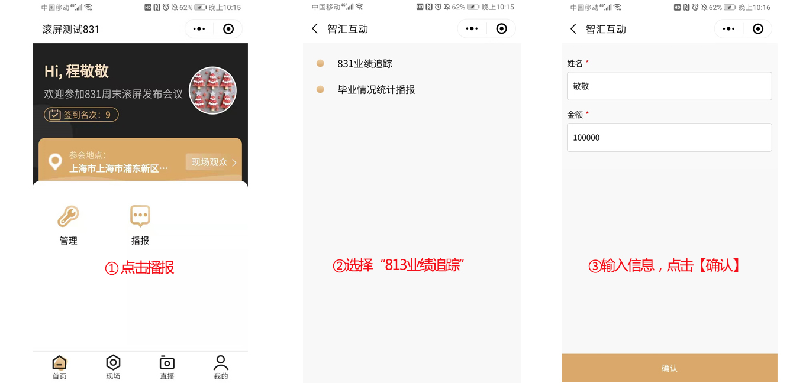

## 大屏展示

**<h3 id="1"> 
 大屏展示
</h3>**
活动场景创建成功后，可以通过大屏进行展示；

**1、签到页面**

**2、弹幕页面**

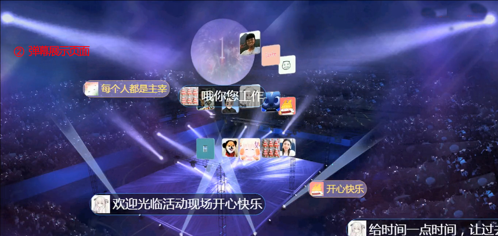

## 支付与服务

**<h3 id="1"> 
 支付与服务
</h3>**

在线支付方式支持：支付宝、微信支付，其他方式：对公转账。

## 关于发票

**<h3 id="1"> 
 关于发票
</h3>**

关于电子、纸质发票如何开具的帮助说明

（1）用户后台的“发票管理”页面，勾选所需开具发票的订单，点击“批量开票”

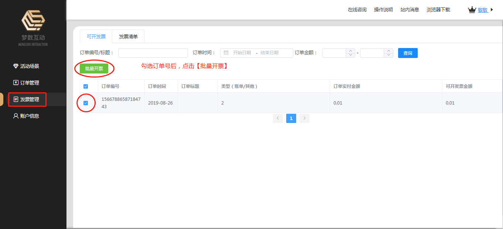

（2）新增开票主题，填写发票信息，抬头及税号需替换成自己公司的相关信息

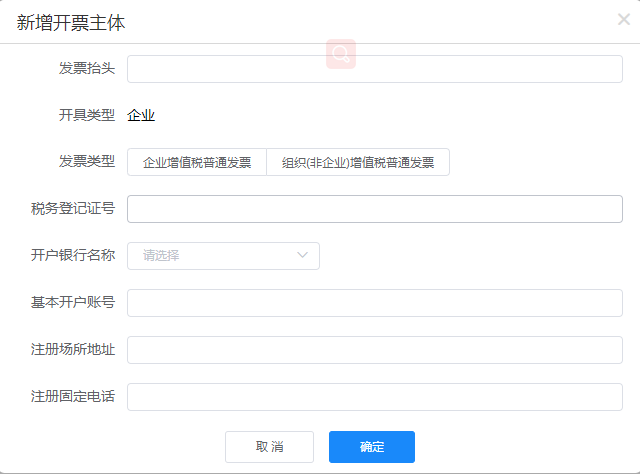

（3）填写收件人、联系电话、地址、邮编等信息；

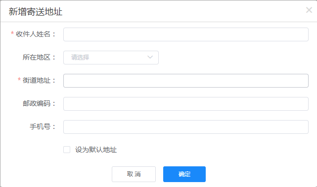

（4）填写完后，确认【开票】即可；

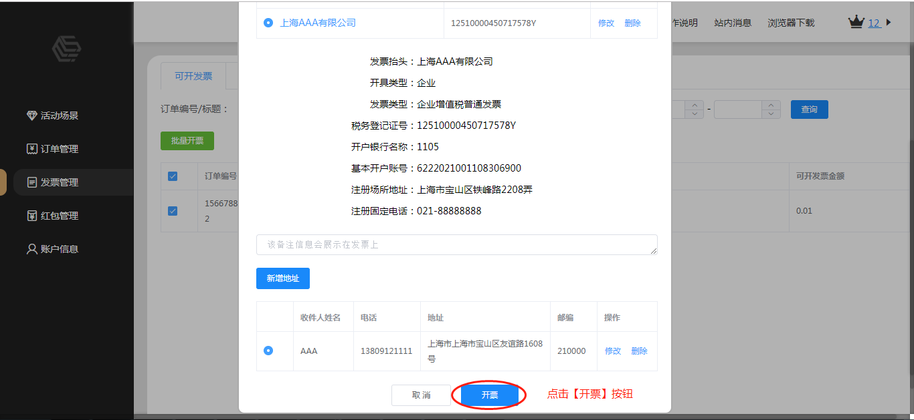

**发票须知：**

**1、发票抬头：** 企业类型发票信息抬头需填写公司营业执照上的全称

**2、纳税人识别号：** 为企业营业执照上面的 18 位统一社会信用代码

## 售后服务

**<h3 id="1"> 
 售后服务 
</h3>**

为了给客户提供周到和及时的服务，可通过 QQ 联系客服、发送邮件到指定的邮箱，也可以加入 QQ 群参与讨论，我们会在您提出问题后，第一时间进行回复。
